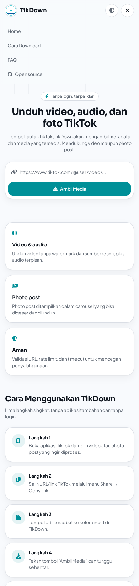
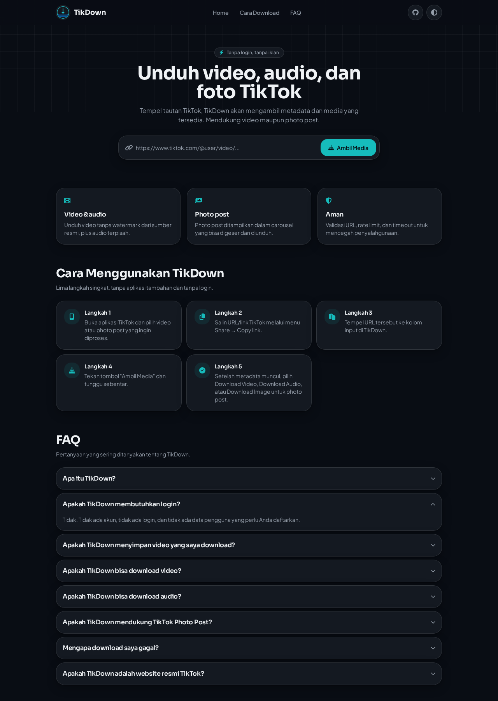

<p align="center">
  
</p>

<h1 align="center">TikDown</h1>

<p align="center">
  
  
  
  
  
  
</p>

<div align="center">

TikDown adalah web app open-source untuk mengambil metadata dan mengunduh media dari tautan
TikTok publik — video (tanpa watermark), audio, dan photo post — langsung dari server tanpa
login dan tanpa database user.

</div>

## 📸 Screenshots

<p align="center">
  
  
</p>

Alur inti: **URL TikTok → Backend → Metadata + Media → Result → Download**

TikDown tidak berafiliasi dengan TikTok dan bukan "official TikTok downloader".

## Fitur

- Download video TikTok tanpa watermark
- Download audio (musik) dari video
- Photo post ditampilkan dalam carousel (swipe/drag, keyboard, indikator, download per foto & semua foto)
- Metadata lengkap: judul, durasi, region, statistik (views/likes/komentar/share), author, musik
- Light / dark / system theme
- Mobile-first, responsive untuk tablet & desktop
- Rate limit, cooldown, concurrency cap, caching, timeout, dan validasi URL di sisi server

## Tech stack

| Layer | Teknologi |
| --- | --- |
| Frontend | React 19, TypeScript, TanStack Start (Vite), Tailwind CSS v4, Framer Motion, Font Awesome |
| API | Server routes TypeScript (`src/routes/api/public/*`), berjalan di edge runtime |
| Downloader service (opsional) | Go (`services/downloader-go`) |

> Catatan arsitektur: repo ini memakai TanStack Start (React + Vite + SSR + server routes),
> bukan Next.js. Alasannya teknis — platform build proyek ini sudah terpasang pada TanStack
> Start, dan server route-nya memberi model API yang setara dengan Next.js route handlers
> (file-based, TypeScript, deploy serverless/edge). Struktur folder, boundary frontend/backend,
> dan kontrak REST tetap sama seperti spesifikasi.

## Struktur project

```
TikDown/
├── src/
│   ├── routes/
│   │   ├── __root.tsx                 # shell, metadata global, font & icon
│   │   ├── index.tsx                  # halaman utama (form + hasil)
│   │   └── api/public/
│   │       ├── download.ts            # POST /api/public/download
│   │       └── media.ts               # GET  /api/public/media (proxy unduhan)
│   ├── components/
│   │   ├── site-header.tsx            # navbar (logo, nav, hamburger mobile, theme)
│   │   ├── site-footer.tsx            # footer (logo, link, disclaimer, copyright dinamis)
│   │   ├── tutorial-section.tsx       # section "Cara Menggunakan TikDown"
│   │   ├── faq-section.tsx            # FAQ accordion
│   │   ├── site-logo.tsx              #  logo dari /public
│   │   ├── result-card.tsx            # kartu hasil (video/photo, stats, author, musik)
│   │   ├── photo-carousel.tsx         # carousel photo post
│   │   └── theme-toggle.tsx           # light / dark / system
│   ├── config/
│   │   └── site.ts                    # identitas situs wajib: NAME/URL/DESCRIPTION/LOGO (edit langsung, bukan env)
│   ├── lib/
│   │   ├── tiktok.server.ts           # downloader service (server-only)
│   │   ├── guard.server.ts            # rate limit, cooldown, concurrency, cache
│   │   └── tikdown.ts                 # tipe & helper shared (client-safe)
│   └── styles.css                     # design system (token oklch)
├── services/downloader-go/            # Go downloader service (opsional, deploy terpisah)
│   ├── cmd/server/main.go
│   └── internal/tiktok/tiktok.go
├── public/
│   ├── logo.png                       # logo navbar & footer (ganti file ini untuk rebrand)
│   ├── favicon.png
│   ├── mobile-menu.png                # screenshot README (mobile)
│   └── desktop-dark.png               # screenshot README (desktop, dark mode)
├── .env.example
└── README.md
```

Modul `*.server.ts` tidak pernah masuk ke bundle browser, jadi logika downloader,
header request, dan konfigurasi internal tidak terekspos di frontend.

## Setup lokal

```bash
git clone https://github.com/Nimzz-pemboy/TikDown.git
cd TikDown
cp .env.example .env      # isi sesuai kebutuhan (semua opsional untuk dev)
bun install                # atau: npm install
bun run dev                 # http://localhost:8080
```

Untuk rebrand (nama, URL, deskripsi, logo), edit `src/config/site.ts` langsung — lihat
[Konfigurasi wajib](#konfigurasi-wajib-bukan-env) di bawah.

Menjalankan Go service (opsional):

```bash
cd services/downloader-go
go run ./cmd/server        # default :8090
```

Lalu set `GO_SERVICE_URL=http://localhost:8090` pada `.env` agar Node API mendelegasikan
proses extract ke Go service. Jika kosong, extractor TypeScript dipakai in-process.

## Konfigurasi wajib (bukan env)

Identitas situs (nama, URL, deskripsi, tagline, logo, repo URL) **wajib** dan langsung
disunting di `src/config/site.ts` — bukan lewat env var. Untuk mengganti logo, cukup ganti
`public/logo.png` (dan `public/favicon.png`) — tidak perlu menyunting komponen.

```ts
// src/config/site.ts
export const siteConfig = {
  name: "TikDown",
  url: "https://example.com",
  description: "...",
  tagline: "TikTok Downloader",
  logo: "/logo.png",
  favicon: "/favicon.png",
  repoUrl: "https://github.com/Nimzz-pemboy/TikDown", // kosongkan untuk sembunyikan link GitHub
} as const;
```

## Environment variables (opsional)

Semua variabel di bawah ini opsional — aplikasi tetap berjalan penuh tanpa satupun diisi.

| Nama | Keterangan |
| --- | --- |
| `GO_SERVICE_URL` | Base URL Go downloader service. Kosong = extractor TS in-process |
| `API_SECRET` | Shared secret dikirim ke Go service via `x-api-secret` |
| `REDIS_URL` | Redis untuk rate limit/cache terdistribusi (default: in-memory) |
| `ALLOWED_ORIGIN` | Origin yang diizinkan CORS (default `*`) |
| `NODE_ENV` | Mode environment |

`.env` tidak pernah di-commit; hanya `.env.example`.

## API documentation

### `POST /api/public/download`

Request:

```json
{ "url": "https://www.tiktok.com/@user/video/1234567890" }
```

Response (video):

```json
{
  "success": true,
  "type": "video",
  "data": {
    "id": "...",
    "type": "video",
    "title": "...",
    "duration": "15 detik",
    "region": "ID",
    "video": "https://...",
    "images": [],
    "author": { "username": "...", "nickname": "...", "verified": true },
    "music": { "title": "...", "url": "https://..." },
    "stats": { "views": 0, "like": 0, "comment": 0, "share": 0 }
  }
}
```

Response (photo post): `type` bernilai `"photo"`, `video` bernilai `null`, dan
`data.images` berisi daftar URL gambar.

Response error selalu berbentuk:

```json
{ "success": false, "error": "Pesan singkat untuk pengguna" }
```

Status yang mungkin: `400` (URL kosong/tidak valid), `404` (tidak ditemukan/privat),
`413` (body terlalu besar), `429` (rate limit / cooldown), `502` (kesalahan server),
`503` (downloader sibuk), `504` (timeout). Error internal, stack trace, dan environment
variable tidak pernah dikirim ke client.

### `GET /api/public/media?url=<media_url>&filename=<nama>`

Streaming proxy agar browser dapat menyimpan media dengan nama file yang benar.
Hanya menerima host CDN TikTok yang di-allowlist.

## Security

- Validasi URL server-side: hanya host `tiktok.com` / subdomainnya
- Validasi request body dengan Zod, batas panjang URL dan ukuran body
- Rate limit per IP (window 60s), cooldown antar request, batas concurrent job
- Cache hasil per URL (10 menit) sehingga URL yang sama tidak di-scrape ulang
- Timeout request upstream (`AbortSignal.timeout`)
- Allowlist host pada media proxy, `Content-Disposition` aman, nama file disanitasi
- Security header: `X-Content-Type-Options`, `Referrer-Policy`, `Cache-Control: no-store`
- CORS dapat dibatasi ke satu origin lewat `ALLOWED_ORIGIN`
- Pesan error generik; tidak ada detail teknis yang dibocorkan

TikDown tidak berisi mekanisme untuk melewati CAPTCHA atau anti-bot pihak lain.
Tujuan lapisan keamanan di atas adalah melindungi TikDown dari abuse.

### Cloudflare

Arsitekturnya kompatibel dengan Cloudflare (runtime edge, tanpa dependensi Node native).
Di depan domain, aktifkan WAF, Rate Limiting Rules pada `/api/public/*`, Bot Fight Mode,
dan throttling sesuai kebutuhan. Untuk deployment multi-instance, ganti penyimpanan
in-memory pada `src/lib/guard.server.ts` dengan Redis (`REDIS_URL`) atau KV.

## Deployment

**Frontend + Node API:** deploy repo ini ke Vercel (atau platform lain yang mendukung
TanStack Start). Set environment variable pada dashboard project. Build command
`bun run build`, output otomatis.

**Go downloader service:** Vercel tidak menjalankan persistent Go server, jadi jangan
dipaksakan. Deploy `services/downloader-go` secara terpisah (Fly.io, Railway, Render, VPS,
atau Docker), lalu set `GO_SERVICE_URL` dan `API_SECRET` di project frontend/API.
Tanpa Go service, aplikasi tetap berfungsi penuh memakai extractor TypeScript.

## Development

- `bun run dev` — dev server
- `bun run build` — production build
- Downloader dapat diganti dengan menyunting satu file: `src/lib/tiktok.server.ts`
  (dan `services/downloader-go/internal/tiktok/tiktok.go` untuk versi Go)

## Contributing

Pull request dan issue terbuka untuk siapa saja. Fork repo ini, buat branch baru, dan ajukan
PR ke `main`. Untuk perubahan besar, buka issue dulu untuk didiskusikan.

---

Developed by **NIMZZ**.
GitHub: [github.com/Nimzz-pemboy](https://github.com/Nimzz-pemboy)
Repository: [github.com/Nimzz-pemboy/TikDown](https://github.com/Nimzz-pemboy/TikDown)

## License

Placeholder: MIT. Tambahkan file `LICENSE` sesuai kebutuhan Anda.
